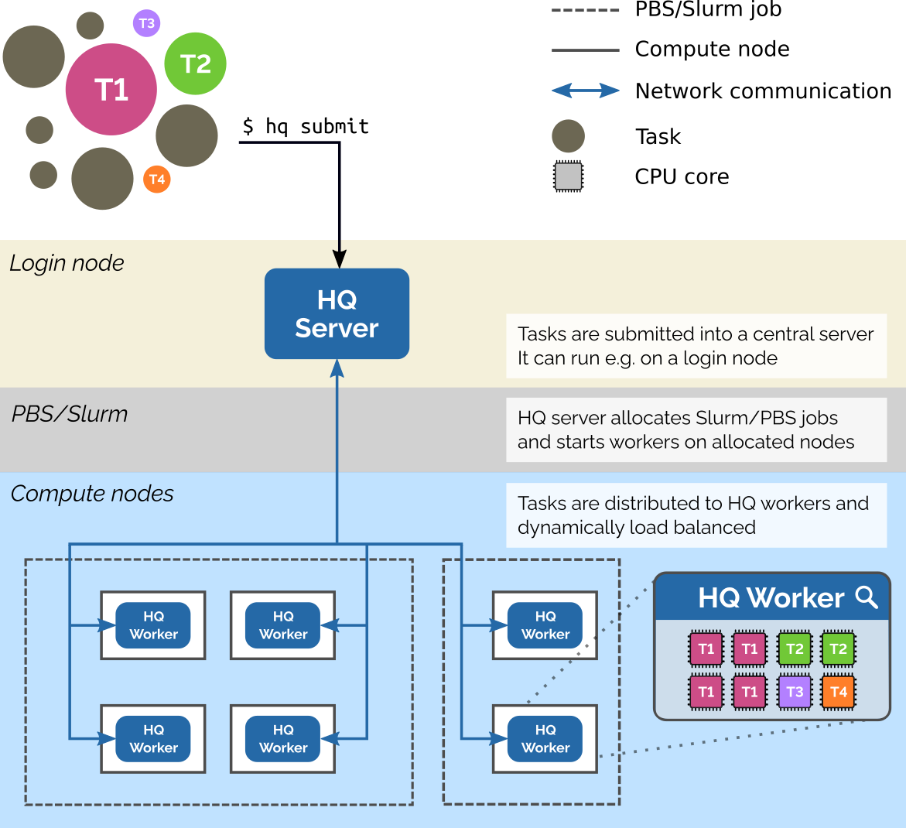
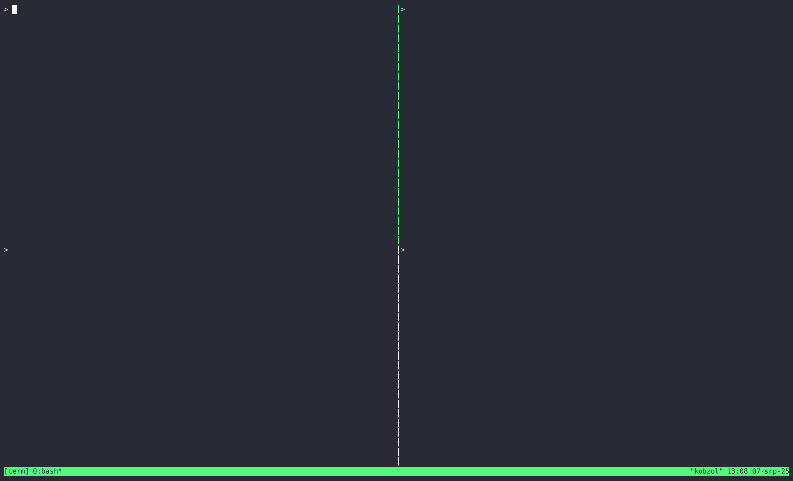

<p align="center">

</p>

 [](https://www.sciencedirect.com/science/article/pii/S2352711024001857) [](https://zenodo.org/badge/latestdoi/349152473)

**HyperQueue** is a tool designed to simplify execution of large workflows (task graphs) on HPC clusters. It allows you
to execute a large number of tasks in a simple way, without having to manually submit jobs into batch schedulers like
Slurm or PBS. You specify what you want to compute and HyperQueue automatically asks for computational resources
and dynamically load-balances tasks across all allocated nodes and resources. HyperQueue can also work without Slurm/PBS
as a general distributed task execution engine.

[Documentation](https://it4innovations.github.io/hyperqueue/)

- You can check out [examples](docs/examples) to see how to use HyperQueue.
- If you find a bug or a problem with HyperQueue, please create an [issue](https://github.com/It4innovations/hyperqueue/issues).
- For more general discussion or feature requests, please use our
[discussion forum](https://github.com/It4innovations/hyperqueue/discussions).
- If you want to chat with the HyperQueue developers, you can use our [Zulip](https://hyperqueue.zulipchat.com/) server.

> If you use HyperQueue in your research, please consider [citing it](#publications).

This image shows how HyperQueue can work on a distributed cluster that uses Slurm or PBS:



You can find a talk from the e-INFRA conference that describes the basics of HyperQueue [here](https://youtu.be/wIxgKOAM0NE?list=PLvwguJ6ySH1cANA1cRZzJDSS8UH-ef0Xn&t=9692).

## Demo
This demo shows simple usage of HyperQueue to execute a few hundred commands (tasks), with dynamic scaling both up and down based on the number of connected workers.

<div>
  
</div>

## Features

- **Complex resource management**
    - Load balancing of tasks across all available (HPC) resources
    - Automatic submission of Slurm/PBS jobs on behalf of the user
    - Complex and arbitrary task resource requirements (# of cores, GPUs, memory, FPGAs, ...)
      - Non-fungible resources (tasks are assigned specific resources, e.g. a GPU with ID `1`)
      - Fractional resources (tasks can require e.g. `0.5` of a GPU)
      - Resource variants (tasks can require e.g. `1 GPU and 4 CPU cores` OR `16 CPU cores`)
      - Related resources (tasks can require e.g. `4 CPU cores in the same NUMA node`)

- **High performance**
    - Scales to hundreds of nodes/workers and millions of tasks
    - Overhead per one task is below `0.1ms`
    - Allows streaming of stdout/stderr from tasks to avoid creating many small files on distributed filesystems

- **Simple user interface**
    - Task graphs can be defined via a CLI, TOML workflow files or a Python API
    - Cluster utilization can be monitored with a real-time dashboard

- **Easy deployment**
    - Provided as a single, statically linked binary without any runtime dependencies (apart from `libc`)
    - No admin access to a cluster is needed for its usage

## Installation

* Download the latest binary distribution from this [link](https://github.com/It4innovations/hyperqueue/releases/latest).
* Unpack the downloaded archive:

  ```bash
  $ tar -xvzf hq-<version>-linux-x64.tar.gz
  ```

* That's it! Just use the unpacked `hq` binary.

> If you want to try the newest features, you can also download a nightly
> [build](https://github.com/It4innovations/hyperqueue/releases/nightly).

## Submitting a simple task

* Start a server (e.g. on a login node, a cluster partition, or simply on your PC)

  ```bash
  $ hq server start &
  ```
* Submit a job (command ``echo 'Hello world'`` in this case)

  ```bash
  $ hq submit echo 'Hello world'
  ```
* Ask for computing resources

    * Either start a worker manually

      ```bash
      $ hq worker start &
      ```

    * Or configure automatic submission of workers into PBS/SLURM

      - PBS:

        ```bash
        $ hq alloc add pbs --time-limit 1h -- -q <queue>
        ```
      - Slurm:

        ```bash
        $ hq alloc add slurm --time-limit 1h -- -p <partition>
        ```

* See the result of the job once it finishes

  ```bash
  $ hq job wait last
  $ hq job cat last stdout
  ```

## What's next?

Check out the [documentation](https://it4innovations.github.io/hyperqueue/).

You can find FAQ (frequently asked questions) [here](https://it4innovations.github.io/hyperqueue/stable/faq).

## HyperQueue team

We are a group of researchers working at [IT4Innovations](https://www.it4i.cz/), the Czech National
Supercomputing Center. We welcome any outside contributions.

## Publications

- [HyperQueue: Efficient and ergonomic task graphs on HPC clusters](https://www.sciencedirect.com/science/article/pii/S2352711024001857)
  (paper @ SoftwareX journal)
- [HyperQueue: Overcoming Limitations of HPC Job Managers](https://sc21.supercomputing.org/proceedings/tech_poster/tech_poster_pages/rpost104.html)
  (poster @ SuperComputing'21)

If you want to cite HyperQueue, you can use the following BibTex entry:

```bibtex
@article{hyperqueue,
  title = {HyperQueue: Efficient and ergonomic task graphs on HPC clusters},
  journal = {SoftwareX},
  volume = {27},
  pages = {101814},
  year = {2024},
  issn = {2352-7110},
  doi = {https://doi.org/10.1016/j.softx.2024.101814},
  url = {https://www.sciencedirect.com/science/article/pii/S2352711024001857},
  author = {Jakub Beránek and Ada Böhm and Gianluca Palermo and Jan Martinovič and Branislav Jansík},
  keywords = {Distributed computing, Task scheduling, High performance computing, Job manager}}
}
```

## Acknowledgement

* This work was supported by the LIGATE project. This project has received funding from the European High-Performance Computing Joint Undertaking (JU) under grant agreement No 956137. The JU receives support from the European Union’s Horizon 2020 research and innovation programme and Italy, Sweden, Austria, the Czech Republic, Switzerland.

* This work was supported by the Ministry of Education, Youth and Sports of the Czech Republic through the e-INFRA CZ (ID:90140).

## License
[MIT](LICENSE)
