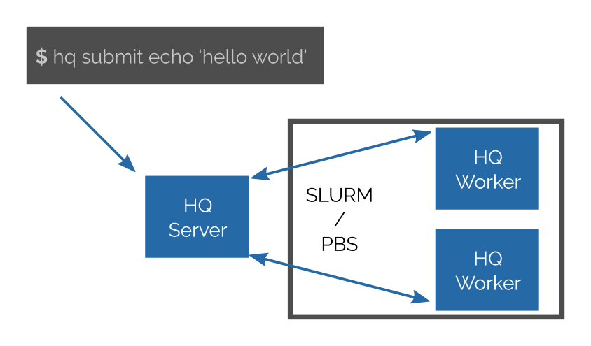

**Warning** this project is under heavy development; it works on a basic level, but we are still working on some important features.

[[Documentation]](https://spirali.github.io/hyperqueue/)

**HyperQueue** (HQ) is a job manager for running many small tasks over systems like SLURM or PBS independently on their job granularity.
HQ removes a need of a manual aggregation of jobs into a bigger pieces while utilizing a whole node.
No admin access to a cluster is needed; easy to deploy; written in Rust, open source.

* Q: **How HQ works?**

  A: You start HQ server somewhere (e.g. login node, cloud partition of a cluster).
     Then you can submit your jobs into HQ server. You may have hundreds of thousands of jobs; they may have various CPUs and other resource requirements*.

     When you start a HQ worker in a cluster (manually or via SLURM or PBS), the server will immediately starts to assigning jobs to workers.

     Workers are fully dynamically controlled by server; you do not specify what jobs are executed on particular worker or configure it in any way.

     HQ provides command line tool for submitting and controlling jobs.

    

    
    

* Q: **What is a job in HQ?**

  A: Right now, we support running arbitrary external programs or bash scripts.
     We plan to support Python defined workflows (with Dask-like API).

* Q: **How to deploy HQ?**

  A: HQ is distributed as a single self-contained staticaly linked binary.
     It allows to start server, workers, and serves as command line interface to
     submit and control jobs.
     No other services are needed. (See example below)

* Q: **Do I need to SLURM or PBS to run HQ?**

  A: No, HQ is designed to smoothly works on systems with SLURM or PBS, but does not require any functionality of these systems.

* Q: **Is HQ replacement for SLURM or PBS?**

  A: Definitely no. Multi-tenancy is out of the scope of HQ, i.e. HQ does not provide user isolation or fairness. HQ is light-weight and easy to deploy; on HPC system each user (or a group of users that trust each other) may run own instance of HQ.

* Q: **Do I need HPC cluster to run HQ?**

  A: No. None of functionality is bounded to any HPC technology. Communication between all components are done through TCP/IP. You can also run HQ fully locally.

* Q: **Is it safe to run HQ on a login node with other users?**

  A: Yes. All communication is secured. The server generates a secret file. Who has access to this file may submit jobs and connect workers. Users without secret will only see that the service is running.

* Q: **What is difference between HQ and Snakemake?**

  A: In cluster mode, Snakemake submits each Snakemake job as one job in SLURM/PBS.
  If your jobs are too small you have to manually aggregate them.
  Contrary, in HQ, the user does not aggregate jobs into larger pieces. User only submits tasks to HQ and they are automatically and dynamically assigned to workers.

* Q: **How many tasks may I submit into HQ?**

  A: We did not benchmark HQ itself yet, but our backend library used in HQ handles
  hunderds of thousands tasks with 1ms overhead per task with depencies and around 0.1ms per a task without dependencies.

* Q: **Does HQ support dependencies?**

  A: Not yet, but we consider it as first class feature. It is actually implemented in the scheduling core, but it has no user interface yet.

# Getting started

## Installation

* Download latest binary distribution from http://TODO
* Unpack the downloaded archive:

  ``$ tar xvzf hq-XXX-linux64.tar.gz``

## Simple usage

* Start server (e.g. on a login node or in the cluster partition)

  ``$ hq server start``

* Submit a job (command ``echo 'Hello world'`` in this case)

   ``$ hq submit echo 'Hello world'``

* Ask for computing resource

    * Manual starting a worker

      ``$ hq worker start``

    * Automatic resource request
      [Not implemented yet]

    * Manual request in PBS

      ``$ qsub <your-params-of-qsub> -- hq worker start``

    * Manual request in SLURM

      ``sbatch <your-params-of-sbatch> -- hq worker start``

* Monitor the state of tasks

  ``$ hq jobs``

# What next?

[Documentation](https://spirali.github.io/hyperqueue/)

# Roadmap

## 0.1

* [x] Basic worker management
* [x] Submitting, observing and canceling a simple jobs
* [x] Encryption and authentication

## 0.2

* [ ] Tasks that takes more than 1 cpu
* [ ] Job arrays

## 0.3

* [ ] Time constraints
* [ ] Priorities

## Next releases (unordered)

* [ ] API for dependencies
* [ ] Generic resource management
* [ ] Python API