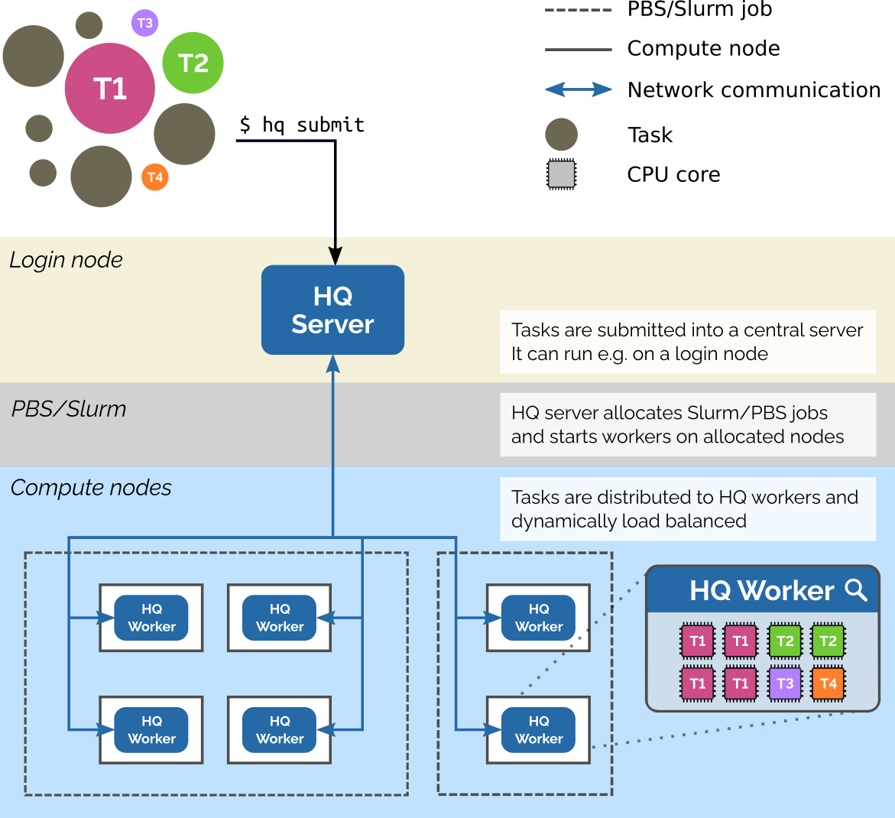

  

**HyperQueue** is a tool designed to simplify execution of large workflows on HPC clusters. It allows you to execute a
large number of tasks in a simple way, without having to manually submit jobs into batch schedulers like PBS or Slurm.
You just specify what you want to compute – HyperQueue will automatically ask for computational resources and dynamically
load-balance tasks across all allocated nodes and cores.

## Useful links
- [Installation](install.md)
- [Quick start](quickstart.md)
- [Repository](https://github.com/It4innovations/hyperqueue)

## Features
- Automatic management of batch jobs
  - *HQ* automatically asks for computing resources
  - Computation is distributed amongst all a

- **Performance**
  - The inner scheduler can scale to hundreds of nodes
  - The overhead for one task is below 0.1ms.
  - *HQ* allows to stream outputs from tasks to avoid creating many small files on a distributed filesystem

- **Easy deployment**
  - *HQ* is provided as a single, statically linked [binary](install.md) without any dependencies
  - No admin access to a cluster is needed to use *HQ*

## Architecture
HyperQueue has two runtime components:

- **Server**: a long-lived component which can run e.g. on a login node of a computing cluster. It handles task
  submitted by the user, manages and asks for HPC resources (PBS/Slurm jobs) and distributes tasks to available workers.
- **Worker**: runs on a computing node and actually executes submitted tasks.

  

You can find more information about the architecture of HyperQueue [here](deployment.md).
