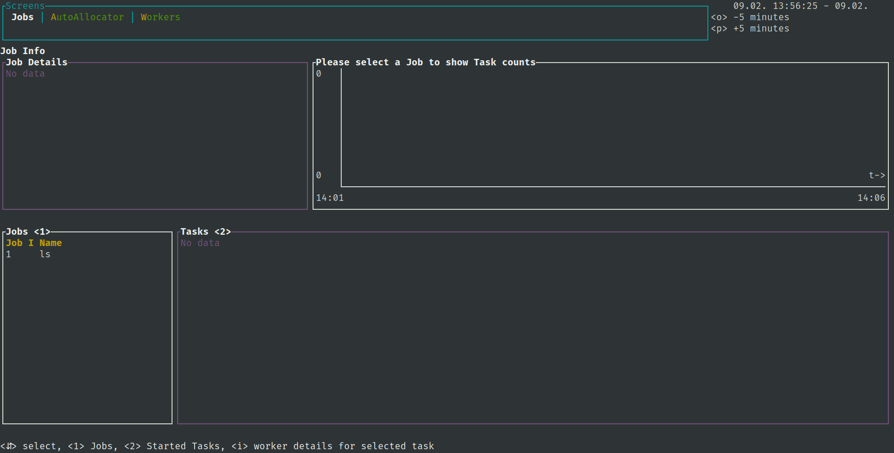

HyperQueue offers a command-line dashboard that shows information about the state of workers and jobs. It can show
which jobs are currently queued or running, which tasks are running on which workers, or what is the current hardware
utilization of workers.

!!! warning

    The dashboard is currently in an experimental stage. Some of its features might not work properly,
    and important features might be missing. Please [let us know](https://github.com/It4innovations/hyperqueue/issues)
    if you encounter any issues with it, or if you want us to add new features to it.

You can start the dashboard using the [`hq dashboard`](cli:hq.dashboard) command:
```bash
$ hq dashboard
```
The dashboard will try to connect to a running HyperQueue server, and display various information. You can navigate
the dashboard using your keyboard.

!!! note

    You have to enable [journalling](../deployment/server.md#resuming-stoppedcrashed-server) in order to see any data in the dashboard.

Here is an example video that shows how does the dashboard look like:

