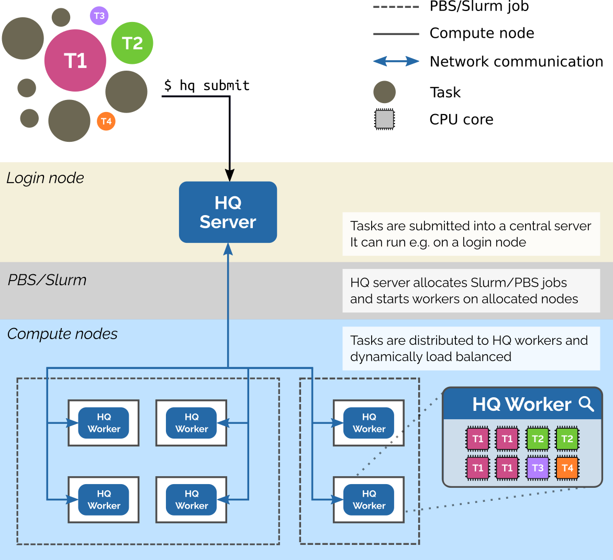

# Architecture
HyperQueue has two runtime components:

- **Server**: a long-lived component which can run e.g. on a login node of a computing cluster. It handles task
  submitted by the user, manages and asks for HPC resources (PBS/Slurm jobs) and distributes tasks to available workers.
- **Worker**: runs on a computing node and actually executes submitted tasks.

  

Server and the workers communicate over encrypted TCP/IP channels. The server may run on any machine, as long as the workers
are able to connect to it over TCP/IP. Connecting in the other direction (from the server machine to the worker nodes) is
not required. A common use-case is to start the server on a login of an HPC system.

[comment]: <> (TODO: describe scheduler)

Learn more about deploying [server](server.md) and the [workers](worker.md).

There is also a third component that we call the **client**, which represents the users of HyperQueue invoking various `hq` commands to communicate with the server component.
