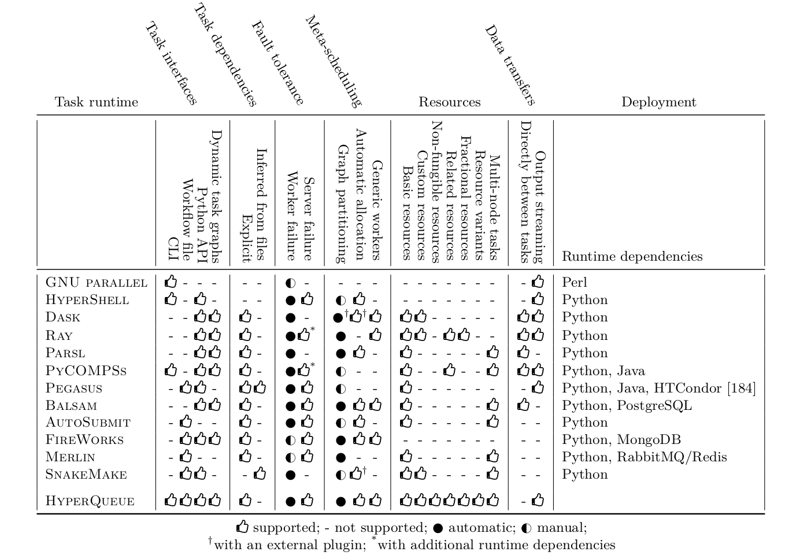

# Comparison with other task runtimes
There is a very large number of different task runtimes, with various performance characteristics,
feature sets, programming models and trade-offs, and it is of course infeasible to compare HyperQueue with all of them. One of HyperQueue's authors has written a [PhD thesis](https://kobzol.github.io/phd) titled `Ergonomics and efficiency of workflows on HPC clusters`, which includes a section that [compares](https://kobzol.github.io/phd/#pf9b) HyperQueue with several other tools. We invite you to examine this section (and the whole thesis) if you want to find out more about the relation of HyperQueue to other task runtimes.

> The descriptions of other task runtimes presented on this page are actual as of October 2024.

Below you can find a table[^table], which compares selected features of twelve task runtimes that we have experience with and/or that we think are relevant for HyperQueue. You can find more information about the table in Section 7.6 of the thesis.

[^table]: It corresponds to Table 7.2 from the PhD thesis.

Below we also provide **opinionated**[^opinionated] descriptions of selected task runtimes that we think can be reasonable compared with HyperQueue.

[^opinionated]: If you think that our description is inaccurate or misleading, please [file an issue](https://github.com/It4innovations/hyperqueue/issues/new).

- [GNU Parallel](#gnu-parallel)
- [HyperShell](#hypershell)
- [Dask](#dask)
- [Ray](#ray)
- [Parsl](#parsl)
- [PyCOMPSs](#pycompss)
- [Pegasus](#pegasus)
- [Balsam](#balsam)
- [AutoSubmit](#autosubmit)
- [FireWorks](#fireworks)
- [SnakeMake](#snakemake)
- [Merlin](#merlin)

## GNU Parallel
[GNU Parallel](https://www.gnu.org/software/parallel/) is a command-line utility for executing many tasks in parallel on a set of computational nodes. It does not offer many advanced task runtime features, but it does one thing well; it enables a parallelized and even distributed execution of a set of programs with a single command invocation. HyperQueue takes inspiration from this approach, as it offers a CLI that can be used to execute task graphs with many tasks and complex resource requirements with a single command.

## HyperShell
[HyperShell](https://hypershell.readthedocs.io) is primarily designed for
executing many homogeneous tasks using the command-line. It does introduce several useful features
on top of [GNU Parallel](#gnu-parallel), such as automatic task re-execution when a task fails and storing the task state in a database, which enables users to observe the history of executed workflows. It also provides a simple autoscaling functionality that automatically submits allocations. However, tasks in HyperShell are strictly tied to allocations; by default, one task is submitted in a single
allocation. It does provide the option to [bundle](https://hypershell.readthedocs.io/cli/cluster.html) several tasks together, but users
have to specify the maximum bundle size explicitly, which makes load balancing inflexible.
HyperShell does not support task dependencies; therefore, it cannot be used to execute general
task graphs.

## Dask
[Dask](https://www.dask.org/) is a task runtime that is very popular within the Python community,
which allows executing arbitrary task graphs composed of Python functions on a distributed cluster.
It also supports distributing code using `numpy` or `pandas` compatible API.

While Dask by itself does not interact with PBS or Slurm, you can use
[Dask-JobQueue](https://jobqueue.dask.org/en/latest/) to make it operate in a similar fashion as
HyperQueue - with the centralized server running on a login node and the workers running on compute
nodes. Dask does not support arbitrary [resource requirements](jobs/resources.md) and since it is
written in Python, it can [have problems](https://arxiv.org/abs/2010.11105) with scaling to very large
task graphs.

If your use-case is primarily Python-based though, you should definitely give Dask a try, it's a great tool.

## Ray
[Ray](https://docs.ray.io) is a distributed task runtime primarily aimed at parallelizing the
training and inference of machine learning models in Python. It uses a
relatively unique architecture that leverages distributed scheduling; not all task submission and
scheduling decisions need to go through a central location, unlike most other compared task runtimes including HyperQueue. This allows it to scale to an
enormous amount of resources, millions of tasks and thousands of nodes. However, in order to enable
this level of scalability, the workflow itself has to be implemented in a way where tasks submit
new tasks from worker nodes dynamically. Therefore, batch computing use-cases that simply want to
execute a predetermined workflow might be unable to achieve such high performance.

Same as [Dask](#dask), it offers basic resource requirements and it also supports fractional resources
and related resource groups. However, it does not allow expressing multi-node tasks. In contrast to Dask, it is internally implemented in *C++*, which introduces much less overhead than Python.
Even though Ray provides some autoscaling functionality, it does not support Slurm or other
HPC allocation managers. In general, it is not specialized for HPC idiosyncrasies nor for executing arbitrary task graphs; even though it has a low-level interface for creating tasks through Python functions, it primarily focuses on generating task graphs automatically from high-level descriptions of machine learning pipelines, which are then executed e.g. on cloud resources.

## Parsl
[Parsl](https://parsl.readthedocs.io/) is another representative of a Python-oriented task runtime. It
allows defining tasks that represent either Python function calls or command-line application
invocations using Python. Computational resources in Parsl are configured through a
[block](https://parsl.readthedocs.io/en/stable/userguide/execution.html#blocks), a set of preconfigured resources (nodes) designed for executing specific kinds of tasks. In addition to blocks, users also have to specify [launchers](https://parsl.readthedocs.io/en/stable/userguide/execution.html#launchers), which
determine how will be each task executed (e.g. using a Slurm or an MPI
execution command) and also an [executor](https://parsl.readthedocs.io/en/stable/userguide/execution.html#executors), which controls how will be tasks
scheduled and batched into allocations and if the execution will be fault-tolerant. While
these options let users specify how will be their task graph executed on a very granular level, it
requires them to tune this configuration per task graph or target cluster; the
configuration system is also relatively complex. This is in contrast to HyperQueue, which has a fully general resource management model that does not require users to configure anything; tasks are automatically load balanced across all available workers regardless of allocations and workers do not have to be preconfigured for specific tasks.

Parsl has basic support for resource requirements, but does not allow
creating custom user-specified resource kinds. It also allows specifying the number of nodes
assigned to a task; however, such tasks have to be executed within a single block; Parsl
does not allow executing multi-node tasks across different blocks or allocations.

## PyCOMPSs
[PyCOMPSs](https://pypi.org/project/pycompss/) is a Python interface for executing task graphs on top of the COMPSs distributed system. It allows defining arbitrary task graphs and has comprehensive support
for multi-node tasks and basic resource requirements, but it does not allow users to define custom
resource requirements. It was [extended](https://www.researchgate.net/publication/327751922_Executing_linear_algebra_kernels_in_heterogeneous_distributed_infrastructures_with_PyCOMPSs) to support configuration of
NUMA nodes for individual tasks. In terms of scheduling, it implements several
simple scheduling algorithms; users can select which one should be used. Assignment of tasks to allocations is performed in a manual way; users enqueue a task graph (an application), which is then fully executed once that allocation is started.

COMPSs provides basic support for automatic allocation that can dynamically react to computational load. However, it can only add or remove nodes from a primary allocation that is always tied to the execution of a single application; it does not provide fully flexible load balancing. PyCOMPSs is slightly more challenging to deploy than most of the other compared task runtimes, since it also requires a Java runtime environment in addition to a Python interpreter.

## Pegasus
[Pegasus](https://pegasus.isi.edu/documentation/index.html) is a very general workflow management system that can execute %workflows on a wide range of clusters, from HPC to cloud. It provides support
for various additional features that have not been examined in this thesis, such as data provenance
or advanced file management and staging. Its workflows are usually defined using workflow files,
which enable specifying dependencies both explicitly or by inferring them from input/output files
of tasks. It also supports basic resource requirements, but does not allow defining custom
resource kinds nor using multi-node tasks. By default, it maps each
task to a single allocation, but it also allows users to cluster tasks together using
one of several predefined modes. However, users have to configure this clustering manually; it is
not performed fully automatically like in HyperQueue.

In terms of deployment, it has the most complex set of runtime dependencies out of the compared task
runtimes, as it requires not only a Python interpreter and a Java runtime environment, but also the
[HTCondor](https://htcondor.readthedocs.io/en/latest/index.html) workload management system, which can be non-trivial to install on an HPC cluster. Pegasus delegates some of its functionality to
HTCondor; it requires a configured instance of HTCondor before it can execute workflows on a
cluster.

## Balsam
[Balsam](https://balsam.readthedocs.io/en/latest/) is a task runtime for executing workflows defined using Python on HPC clusters. It uses a similar fully flexible method for mapping tasks to
allocations as HyperQueue, including automatic allocation; however, it is limited to a
single allocation queue, similarly as in [Dask](#dask). It supports multi-node tasks,
although users have to statically preconfigure workers to either execute single-node or multi-node
tasks. It does not allow specifying custom resource kinds nor more advanced resource
management offered by HyperQueue, such as [resource variants](jobs/jobfile.md#resource-variants). The Balsam server requires access to a PostgreSQL database instance, which makes
its deployment slightly more challenging than some other tools that do not need a database or that
can use an embedded database like SQLite.

## AutoSubmit
[AutoSubmit](https://autosubmit.readthedocs.io/) is a high-level tool for executing workflows and experiments. It focuses primarily on experiment tracking, data provenance and workflow automation. In its default mode, each task corresponds to a single allocation, which is not ideal for short running tasks; AutoSubmit is designed primarily for coarse-grained workflows. It provides a way to
bundle multiple tasks into the same allocation using [wrappers](https://autosubmit.readthedocs.io/en/master/userguide/wrappers/index.html), but same as with
e.g. [Pegasus](#pegasus), this has to be preconfigured statically by the user; it is not
performed automatically. AutoSubmit does not support custom task resource kinds
and it also does not support direct data transfers between tasks nor output streaming.

## FireWorks
[FireWorks](https://materialsproject.github.io/fireworks/index.html) is a workflow system for managing the execution of workflows on distributed clusters. It allows defining task graphs using either workflow files or through a Python API. It supports fault-tolerant task execution, although failed tasks
have to be re-executed manually. FireWorks does not seem to support any task resource
requirements; resources can only be configured for individual allocations. Its meta-scheduling
approach is relatively complicated; it provides several ways of mapping tasks to allocations and
individual workers with different trade-offs rather than providing a unified way that users would
not have to worry about. FireWorks requires a MongoDB database to store tasks, which can make its deployment slightly challenging.

## SnakeMake
[SnakeMake](https://snakemake.readthedocs.io/en/stable/) is a popular workflow management system for executing coarse-grained workflows defined using workflow files that can be extended with inline Python code. It can operate both as a meta-scheduler (outside of PBS/Slurm) and also as a classical task runtime within a PBS/Slurm job. Its workflows are based on files; tasks are expected to produce and consume files, which are also used to infer dependencies between them. This can pose an issue with a large number of tasks, as the created files can overload distributed filesystems; no output streaming is offered by the task runtime. It enables assigning both known (e.g. CPU or memory) and custom resource kinds to tasks. It also allows specifying the number of nodes required for each task.

With SnakeMake, you can submit a workflow either using a task-per-job model (which has [high overhead](https://docs.nersc.gov/jobs/workflow/snakemake/)) or you can partition the workflow into several jobs, but in that case SnakeMake will not provide load balancing across these partitions, and partitioning the jobs manually can be quite arduous. HyperQueue allows you to submit large workflows without partitioning them manually in any way, as the server will dynamically load balance the tasks onto workers from different PBS/Slurm allocations.

Since SnakeMake workflows are defined in configuration files, it's a bit more involved to run computations in SnakeMake than in HyperQueue. On the other hand, SnakeMake lets you define more complex workflows with improved traceability and reproducibility.

## Merlin
[Merlin](https://github.com/LLNL/merlin) is a task queueing system that enables execution of large workflows on HPC clusters. It leverages the [Celery](https://docs.celeryq.dev/en/stable/) task queue for distributing tasks to workers and the [Maestro](https://maestrowf.readthedocs.io/en/latest/) workflow specification for defining task graphs. Tasks are submitted into separate Celery queues, whose resources need to be preconfigured; its load balancing is thus not fully flexible and automatic like in HyperQueue.

It also does not support automatic allocation and nor does it support custom resource kinds. Failed tasks can be automatically restarted if they end with a specific status code; however, if they fail because of unexpected reasons, users have to mark them for re-execution manually. Merlin requires a message broker backend, such as RabbitMQ or Redis, for its functionality, which makes its deployment non-trivial.

